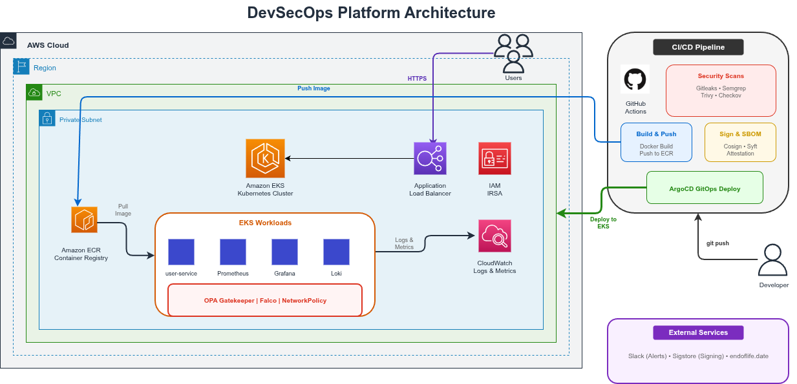

# 🛡️ DevSecOps Platform Template

[](https://github.com/abhishekpanda0620/devsecops-platform-template/actions/workflows/ci.yml)
[](https://github.com/abhishekpanda0620/devsecops-platform-template/actions/workflows/cd.yml)
[](https://github.com/abhishekpanda0620/devsecops-platform-template/actions/workflows/terraform.yml)
[](https://github.com/abhishekpanda0620/devsecops-platform-template/actions/workflows/eol-check.yml)
[](https://opensource.org/licenses/MIT)

**📖 Read the Blog Series**: [Part 1: Infrastructure](https://medium.com/@abhishek.panda0620/how-i-built-a-production-grade-devsecops-platform-so-you-dont-have-to-b91b1c1558d6) | [Part 2: GitOps](pending) | [Part 3: Security](pending)

A **production-ready, opinionated DevSecOps framework** that provides a complete CI/CD + security + GitOps + Kubernetes deployment template for any application.

---

## 🎯 Goals

- ✅ **End-to-end security automation** across the SDLC
- ✅ **Reusable CI/CD pipelines** and IaC modules
- ✅ **Runnable Kubernetes reference environment** (dev & prod overlays)
- ✅ **GitOps-first deployment model** with ArgoCD
- ✅ **Modular and easy to fork** for organizations

---

## 🏗️ Architecture



---

## 📂 Repository Structure

```
devsecops-platform-template/
│
├── .pre-commit-config.yaml      # Pre-commit hooks (security + quality)
├── .secrets.baseline            # Secret detection baseline
│
├── .github/workflows/           # GitHub Actions CI/CD
│   ├── ci.yml                   # Main CI pipeline
│   ├── cd.yml                   # Continuous Delivery pipeline
│   ├── security.yml             # Security scans (scheduled + on-demand)
│   └── terraform.yml            # Infrastructure pipeline
│
├── app/                         # Sample microservice
│   ├── src/                     # Application source code
│   ├── tests/                   # Unit & integration tests
│   ├── Dockerfile               # Multi-stage Dockerfile
│   └── package.json             # Dependencies
│
├── security/                    # Security tools configuration
│   ├── semgrep/                 # SAST rules
│   ├── gitleaks/                # Secret detection config
│   ├── trivy/                   # Container scanning

│
├── infra/                       # Infrastructure as Code
│   ├── terraform/               # Cloud infrastructure
│   │   ├── environments/
│   │   │   └── dev/
│   │   │       ├── foundation/  # VPC, EKS, ECR, OIDC (Layer 1)
│   │   │       └── addons/      # ArgoCD, GitOps (Layer 2)
│   │   └── modules/
│   │       ├── vpc/             # Enterprise VPC module
│   │       ├── eks/             # EKS cluster module
│   │       ├── ecr/             # Container registry module
│   │       ├── github-oidc/     # GitHub Actions OIDC auth
│   │       └── eks-gitops/      # ArgoCD/GitOps module
│   ├── k8s/                     # Kubernetes manifests (Kustomize)
│   ├── helm/                    # Helm charts
│   │   └── charts/observability/  # Prometheus, Grafana, Loki values
│   └── argocd/                  # GitOps manifests
│       └── apps/observability/  # Observability stack ArgoCD apps
│

├── docs/                        # Documentation
│   ├── PROJECT_OVERVIEW.md      # Complete project explanation
│   ├── observability.md         # Monitoring/logging guide
│   ├── pre-commit.md            # Pre-commit hooks guide
│   └── ...                      # Architecture, security, etc.
│
├── sbom/                        # Software Bill of Materials
└── Makefile                     # Automation commands
```

---

## 🚀 Quick Start

### Prerequisites

- Docker & Docker Compose
- Node.js 24+ (for sample app)
- kubectl & helm (for K8s deployment)
- Terraform 1.14+ (for infrastructure)

### Local Development

```bash
# Clone the repository
git clone https://github.com/abhishekpanda0620/devsecops-platform-template.git
cd devsecops-platform-template

# Initialize the project
make init

# Start local development environment
make dev

# Run security checks locally
make security-scan

# Build and test
make build test
```

### Deploy to Kubernetes

```bash
# Deploy infrastructure (EKS)
make infra-plan
make infra-apply

# Deploy application via ArgoCD
make deploy-argocd
```

---

## 🔒 Security Features

| Tool | Purpose | Stage |
|------|---------|-------|
| **Gitleaks** | Secret detection | Pre-commit, CI |
| **Semgrep** | Static code analysis (SAST) | CI |
| **Trivy** | Vulnerability scanning (SCA, Container) | CI |
| **Syft** | SBOM generation | Build |
| **Cosign** | Image signing & verification | Build, Deploy |


---

## 📊 Observability Stack

| Component | Purpose | Access |
|-----------|---------|--------|
| **Prometheus** | Metrics collection and alerting | `make observability-portforward` |
| **Grafana** | Visualization dashboards | Port 3000 |
| **Loki** | Log aggregation | Integrated in Grafana |
| **Alertmanager** | Alert routing and notifications | Port 9093 |


```bash
# Install via ArgoCD (GitOps - recommended)
make observability-argocd

# Or install via Helm directly
make observability-install

# Access Grafana
make observability-portforward
```

---

## 🔄 GitOps Workflow (Continuous Delivery)

This project implements **Continuous Delivery** (not Continuous Deployment):

- ✅ **Staging**: Automatic deployment on tag push
- ⏸️ **Production**: Requires manual approval (industry best practice)

```
┌──────────┐     ┌──────────┐     ┌──────────┐     ┌──────────┐
│   Dev    │ ──▶ │ Staging  │ ──▶ │   Prod   │ ──▶ │  Rollback│
│  (auto)  │     │  (auto)  │     │ (manual) │     │  (auto)  │
└──────────┘     └──────────┘     └──────────┘     └──────────┘
     │                │                │                │
     └────────────────┴────────────────┴────────────────┘
                         ArgoCD Sync
```

| Stage | Trigger | Automatic? |
|-------|---------|------------|
| Dev | Push to main | ✅ Yes |
| Staging | Tag push (v*) | ✅ Yes |
| Production | After staging + approval | ⏸️ Manual |

> **Why Continuous Delivery?** Most enterprises require human approval before production changes. This is the recommended approach for risk management and compliance.

---

## 📚 Documentation

- [Architecture Overview](docs/architecture.md)
- [Pipeline Reference](docs/pipelines.md)
- [Security Guide](docs/security.md)
- [GitOps Setup](docs/gitops.md)
- [Setup Guide](docs/setup-guide.md)
- [Observability Stack](docs/observability.md)
- [Alert Simulation Guide](docs/simulation/Alert_Simulation_Guide.md)
- [Pre-commit Hooks](docs/pre-commit.md)
- [Roadmap](docs/ROADMAP.md)
- [Project Overview](docs/PROJECT_OVERVIEW.md)
- [Root Cause Analysis](docs/RCA/)

---

## 🪝 Pre-commit Hooks

Enforce code quality and security locally:

```bash
# Install pre-commit hooks
make pre-commit-install

# Run on all files
make pre-commit-run
```

Includes: Gitleaks, Semgrep, ESLint, Terraform fmt/validate, Hadolint, and more.

---

## 🤝 Contributing

See [CONTRIBUTING.md](CONTRIBUTING.md) for contribution guidelines.

---

## 📄 License

This project is licensed under the MIT License - see the [LICENSE](LICENSE) file for details.

---

## ⭐ Show Your Support

Give a ⭐️ if this project helped you!

---

*Built with ❤️ for the DevSecOps community*
