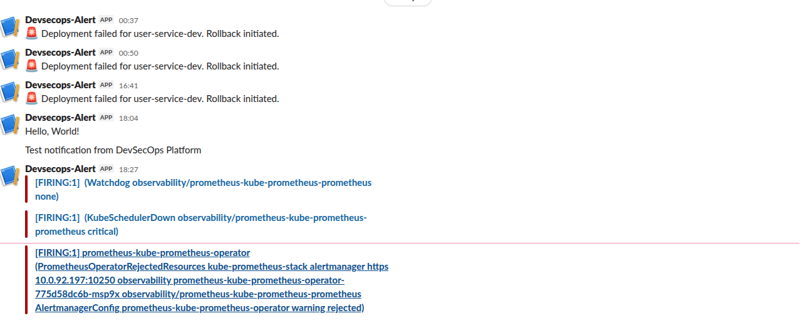
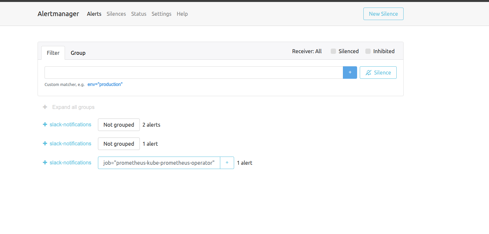

# 🚨 Alert Simulation Guide

This guide provides instructions on how to manually trigger specific alerts in the system to test the observability pipeline and Slack notifications.

## 1. Trigger `TargetDown` Alert

This alert fires when Prometheus cannot scrape metrics from a configured target. We will simulate this by scaling down the `user-service` to 0 replicas, effectively making the target disappear/fail.

### Trigger

```bash
# Scale down the user-service deployment
kubectl scale deployment user-service -n dev --replicas=0
```

### Verification: TargetDown

1. Check Prometheus Targets: `Status` -> `Targets` (look for `user-service`).
2. Wait ~1-2 minutes for the alert to fire.
3. Check Slack for the `TargetDown` notification.



### Resolve

```bash
# Restore the service
kubectl scale deployment user-service -n dev --replicas=1
```

---

## 2. Trigger `Watchdog` Alert (Always On)

The `Watchdog` alert is an "always-firing" alert meant to ensure the entire alerting pipeline is functional. It has `severity="none"`.

### Verification: Watchdog

1. Go to Alertmanager URL: `/alertmanager`
2. Verify that `Watchdog` is present and active.



1. Check your Slack channel. If configured correctly, you should see periodic checks or resolved messages depending on your configuration (Note: Watchdog is often silenced or routed differently to avoid spam, but it proves connectivity).

---

## 3. Trigger `KubeControllerManagerDown` (Advanced)

This alert fires when the Controller Manager is unreachable. On EKS, this is often due to restricted access to the control plane.

### Verification: Controller Manager

If you see this alert already in Prometheus, it means the ServiceMonitor cannot reach the AWS-managed Controller Manager endpoints. This requires fixing the EKS security group or ServiceMonitor configuration to resolve, rather than trigger.
